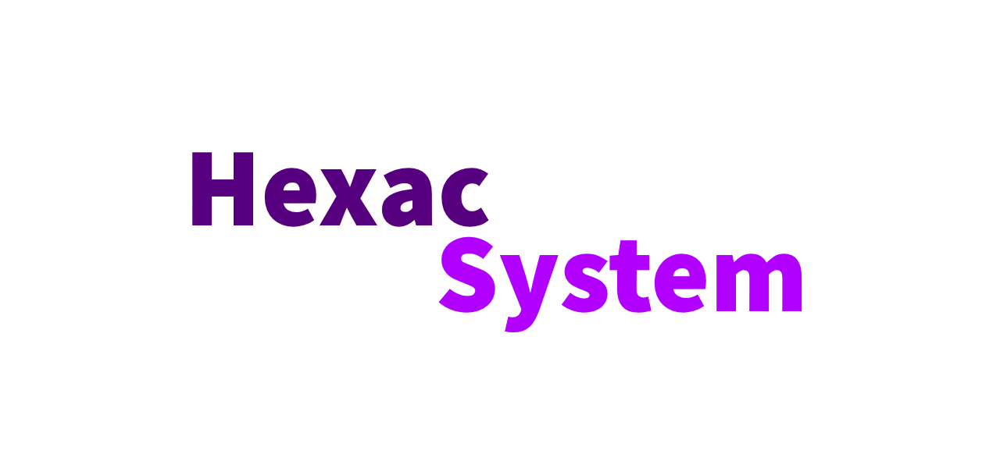

# Hexac System Repository

    <b>Information</b> For more informations about Cpcdos and CpcdosC+ projects, please going on <a href="https://cpcdos.net/en">Cpcdos website<a>

## Welcome to Hexac System Repository !

- Hexac System is an operating system made on Cpcdos OSx kernel.
- Hexac is developped for purpose a new computer experience for the future.
- With a rich software catalog, you can have ease of use in your daily tasks.

## Any screenshoots

